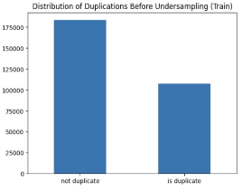
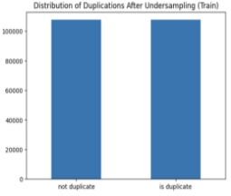
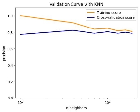
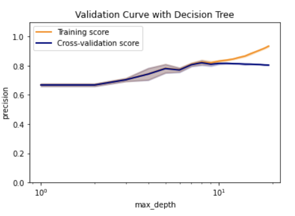
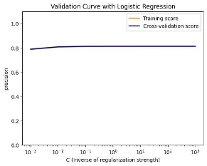

# Quora Question Duplication

Question duplication is a serious issue in question and answer (Q&A) platforms because it would negatively affect user experience. The users would need to spend more time finding the best answers to their questions as discussion for the similar questions is segmented into different post.

The aim of this project is to find out:

1. Which set of characteristics or algorithms are more important in categorizing the questions with similar intent?
1. By how much will neural network outperform the traditional models? Does neural network always perform better?

## Development

### Data Preprocessing for both research questions

#### Data Cleaning

Turn erroneous data into useful by correcting the label

Before:

After:

#### Undersampling

Output classes are imbalance and undersampling is performed, so that the models do not overfit to the majority class.

Before:

After:

#### Word Embedding Generation

Bidirectional Encoder Representations from Transformers (BERT) is chosen for the word embedding generation due to better performance over algorithms like Bag of Words and Word2Vec.

## Research Question 1

1. Feature Extraction

Forty-seven features that are commonly regarded useful, are extracted based on the question pairs and the generated word embedding. The features are documented [here](https://docs.google.com/document/d/1wab9E_1q-yAuqAZp_gLWha2672F8h8zKOZxXYxzDP6I/edit?usp=sharing).

2. Machine Learning Model Selection

Three traditional machine learning models are chosen based on the reasons below.

- K-nearest Neighbors (KNN) - simplest form of machine learning algorithms mostly used for classification
- Decision Tree - the model is easy to be analysed as it is based on simple rules
- Logistic Regression - good for training high dimensional dataset

3. Recursive Feature Elimination

Recursive feature elimination (RFE) is used to find the most important features. While there are other methods such as PCA and LDA, they didn't use these methods because it is hard to explain the features generated. For example, it is unclear what the new basis vector means.

| Comparison           | Justification                                                                                                                                         |
| -------------------- | ----------------------------------------------------------------------------------------------------------------------------------------------------- |
| RFE vs (PCA and LDA) | Hard to explain the features produced by PCA and LDA e.g. what does the new basis vector mean?                                                        |
| RFE vs PCA           | 
PCA only cares about the correlation between two features, does not take performance into account.

May produce non-informative features.
 |

| Models              | Features Selected                                                                                                                                                                                                                                                                             |
| ------------------- | --------------------------------------------------------------------------------------------------------------------------------------------------------------------------------------------------------------------------------------------------------------------------------------------- |
| KNN                 | All 47 features                                                                                                                                                                                                                                                                               |
| Decision Tree       | 'freq_qid1', 'freq_qid2', 'q1len', 'q2len', 'chebyshev', 'canberra', 'cityblock', 'word_mover_distance', 'skew_q1', 'skew_q2', 'cwc_max', 'csc_max', 'ctc_max', 'token_set_ratio', 'longest_substr_ratio'                                                                                     |
| Logistic Regression | 'freq_qid1', 'freq_qid2', 'word_share', 'freq_sum', 'freq_diff', 'braycurtis', 'cosine', 'correlation', 'euclidean', 'squared_euclidean', 'skew_q1', 'kurtosis_q1', 'cwc_min', 'csc_max', 'ctc_min', 'ctc_max', 'abs_len_diff', 'token_sort_ratio', 'token_set_ratio', 'longest_substr_ratio' |

4. Hyperparameter Optimization

Cross validation on the training set is performed to find out the optimal value of hyperparameters for the different models.

n_neighbors = 4

max_depth = 8

C = 1.0

5. Dataset-wide level performance

| Models              | Accuracy | Recall | Precision | F1   |
| ------------------- | -------- | ------ | --------- | ---- |
| KNN                 | 0.78     | 0.71   | 0.83      | 0.76 |
| Decision Tree       | 0.83     | 0.86   | 0.80      | 0.83 |
| Logistic Regression | 0.81     | 0.81   | 0.81      | 0.81 |

Note: _Duplicate_ is the positive case.

We decided to focus on precision because if we mislabelled questions that are different as duplicates, this may lead to these questions being removed from Quora.

Hence, KNN is the model that performs the best to our needs.

6. Microscopic Analysis

While the model may be very complex globally, it is easier to approximate it around the vicinity of this particular instance. Hence, local interpretable model-agnostic explanations (LIME) is used to help us understand why the classifiers are making such predictions.

|                                           | KNN       | Decision Tree | Logistic Regression |
| :---------------------------------------- | --------- | ------------- | ------------------- |
| Confidence                                | 75%       | 68%           | 54%                 |
| % supporting feature among top 5 features | 40%       | 100%          | 60%                 |
| Top supporting feature                    | freq_diff | cwc_max       | squared_euclidean   |

The table can be interpreted as such:

For the KNN model, 6 out of its 8 nearest neighbors are duplicates. _freq_diff_ is the strongest indicator for it to make prediction for this instance, implying that this instance is related closely with its neighbors by _freq_diff_.

7. Conclusion

Based on our findings, it is difficult to determine a set of features to generalise the problem as it ultimately depends on how a person or system approaches the problem.

For example, if the person tends to think like a decision tree, then the 15 features of the decision tree model would be enough and most critical for him/her to make a decently accurate prediction.

## Research Question 2

8. Neural Network Training

With the BERT embeddings, we trained a deep learning feed-forward neural network model with 10 hidden layers and 150 neurons per hidden layer. It takes the two BERT question embeddings as input, and outputs the classification.

The performance of the NN was evaluated, and the precision and recall were about 0.80. We experimented with other number of hidden layers, but found that the number of hidden layers did not affect the performance much.

9. Neural Network Analysis

By sampling misclassifications of the NN, we found a few types of questions that the NN finds difficult to handle. Firstly, it is when question A is a more specific version of another broader question B, which means that the answers for question A can be used to answer question B but not vice versa. The model has some difficulty with determining the extent of overlapping content in the question and cannot classify satisfactorily.

Secondly, it faces difficulty with newer terminologies like “Samsung Galaxy Note 7” vs “Samsung Galaxy Note 8”, which the model likely considers extremely similar since they are just one number away. However, a question asking about Note 8 would be fundamentally different from another asking about Note 7.

10. Conclusion

Comparing the performance between neural networks and the traditional models (kNN, decision tree, logistic regression), we found that they have similar performance in terms of f1 score, recall and precision.

## References

1. Despraz, J., Gomez, S., Satizábal, H. F., & Peña-Reyes, C. A. (2017). Towards a better understanding of deep neural networks representations using Deep Generative Networks. Proceedings of the 9th International Joint Conference on Computational Intelligence. <https://doi.org/10.5220/0006495102150222>
1. Hu, Y., Mello, R. F., & Gašević, D. (2021, October 29). Automatic analysis of cognitive presence in online discussions: An approach using Deep Learning and Explainable Artificial Intelligence. Computers and Education: Artificial Intelligence. Retrieved November 16, 2022, from <https://www.sciencedirect.com/science/article/pii/S2666920X2100031X>
1. Sharma, L., Graesser, L., Nangia, N., & Evci, U. (2019). Natural Language Understanding with the Quora Question Pairs Dataset. ArXiv: Computation and Language. Retrieved 2022, from <https://arxiv.org/ftp/arxiv/papers/1907/1907.01041.pdf>.
1. Zhou, Z.-H., & Feng, J. (2017). Deep Forest: Towards an alternative to deep neural networks. Proceedings of the Twenty-Sixth International Joint Conference on Artificial Intelligence. <https://doi.org/10.24963/ijcai.2017/497>
1. [https://towardsdatascience.com/the-quora-question-pair-similarity-problem-35](https://towardsdatascience.com/the-quora-question-pair-similarity-problem-3598477af172)
1. https://towardsdatascience.com/finding-duplicate-quora-questions-using-mach ine-learning-249475b7d84d
1. [https://medium.springboard.com/identifying-duplicate-questions-a-machine-le arning-case-study-37117723844](https://medium.springboard.com/identifying-duplicate-questions-a-machine-learning-case-study-37117723844)
1. [https://medium.springboard.com/identifying-duplicate-questions-a-machine-le arning-case-study-37117723844](https://medium.springboard.com/identifying-duplicate-questions-a-machine-learning-case-study-37117723844)
1. [https://github.com/seatgeek/fuzzywuzzy ](https://github.com/seatgeek/fuzzywuzzy)10.[https://towardsdatascience.com/finding-duplicate-quora-questions-using-mach ine-learning-249475b7d84d](https://towardsdatascience.com/finding-duplicate-quora-questions-using-machine-learning-249475b7d84d)
